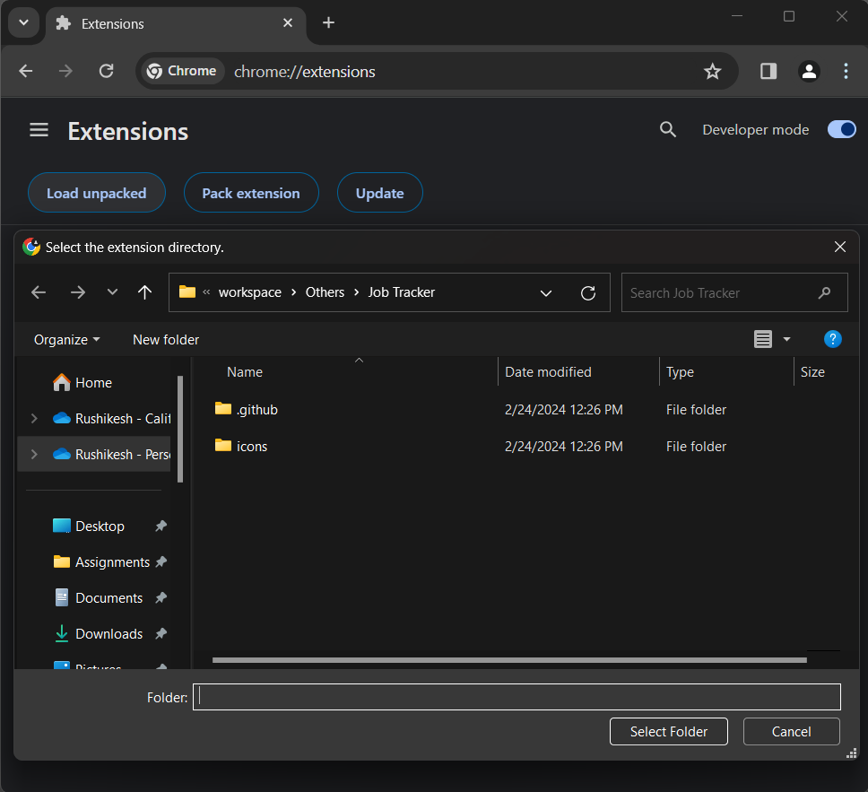
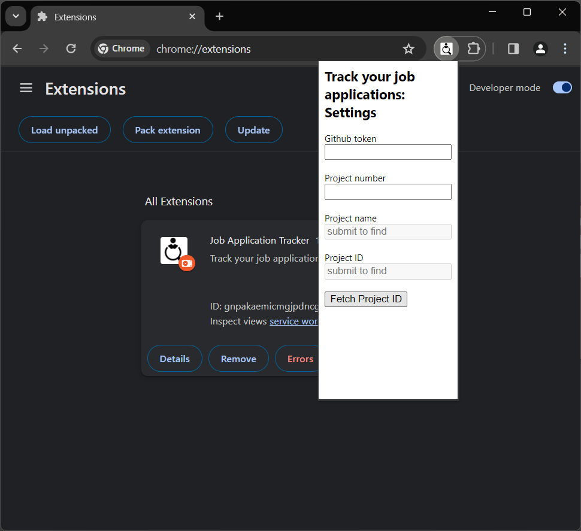
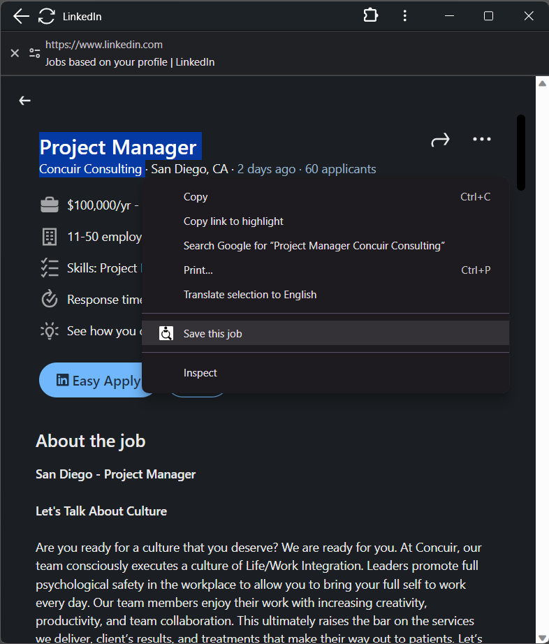
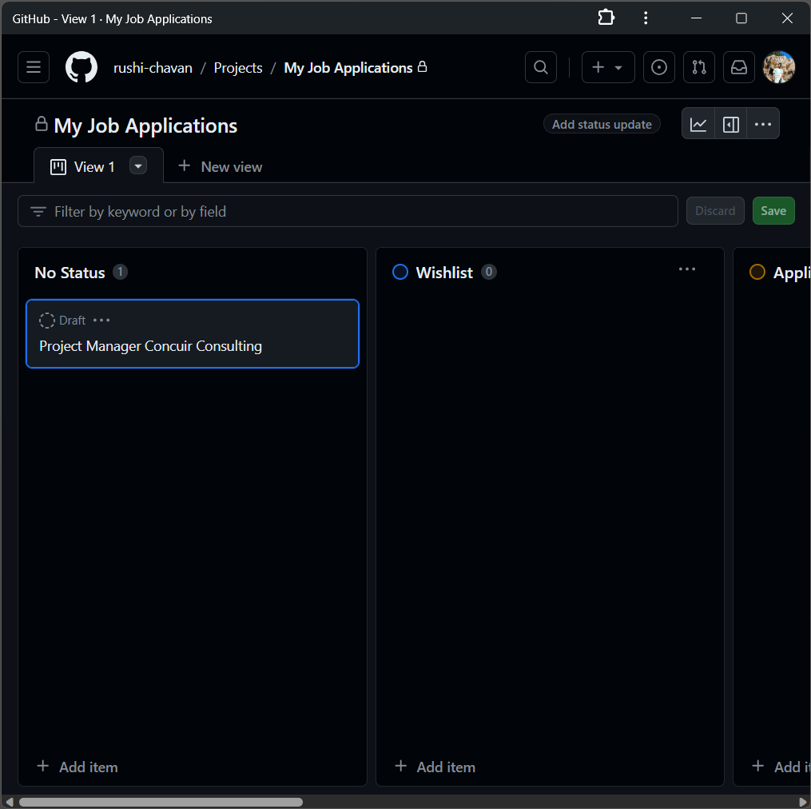
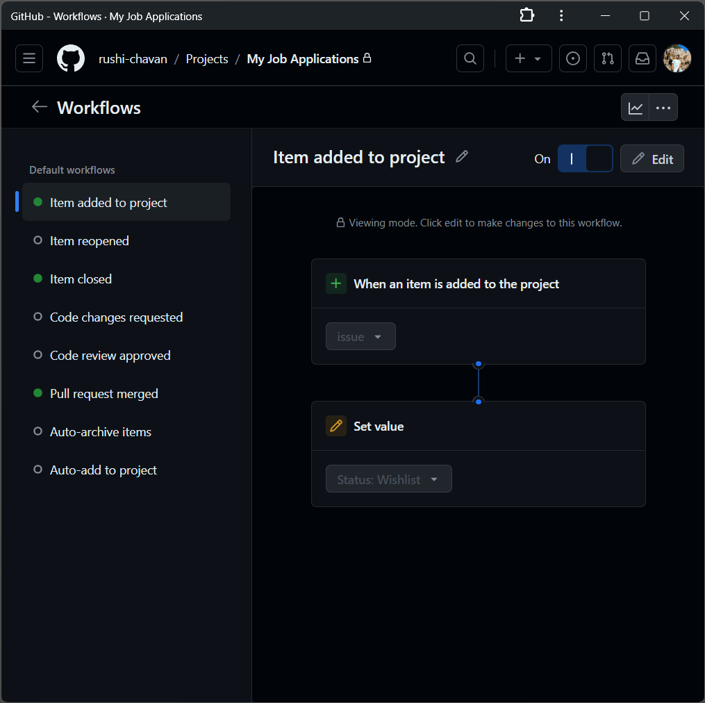

<div align="center" id="top"> 
  
</div>

<h1 align="center">Job Application Tracker</h1>

<p align="center">
  

  

  
</p>

&#xa0;

## Requirements

You need to have GitHub token with read & write access to ProjectsV2.
You also need to create new project in your GitHub profile and get the project number.

## Getting started

- Download the project using git command below or download it as a zip and unzip it.

```bash
# Clone this project
$ git clone https://github.com/rushi-chavan/job-application-tracker
# You can also download this project as zip and unzip it
```

- In Chrome browser, enable the developer mode in [Chrome Extensions](chrome://extensions/)
  <br>

- Use Load unpacked and navigate to the project root folder and import the extension.
  
  <br>

- Once extension loaded, fetch project name and ID by providing GitHUb token and project number. (Project name and Project ID needs to auto filled when to click 'Fetch project ID' to complete the setup)
  
  <br>

- If project ID is fetched successfully, you can start using the extension by 'selecting Job title on any website -> right click -> save this job' and it will reflect in your project.
  
  <br>

- You will find this job synced in your project on GitHub
  

## Tips

- You can create an workflow under your project to assign the status automatically for new items.

<!-- ## :memo: License

This project is under license from MIT. For more details, see the [LICENSE](LICENSE.md) file.

Made with :heart: by <a href="https://github.com/{{YOUR_GITHUB_USERNAME}}" target="_blank">{{YOUR_NAME}}</a>

&#xa0; -->

<a href="#top">Back to top</a>
